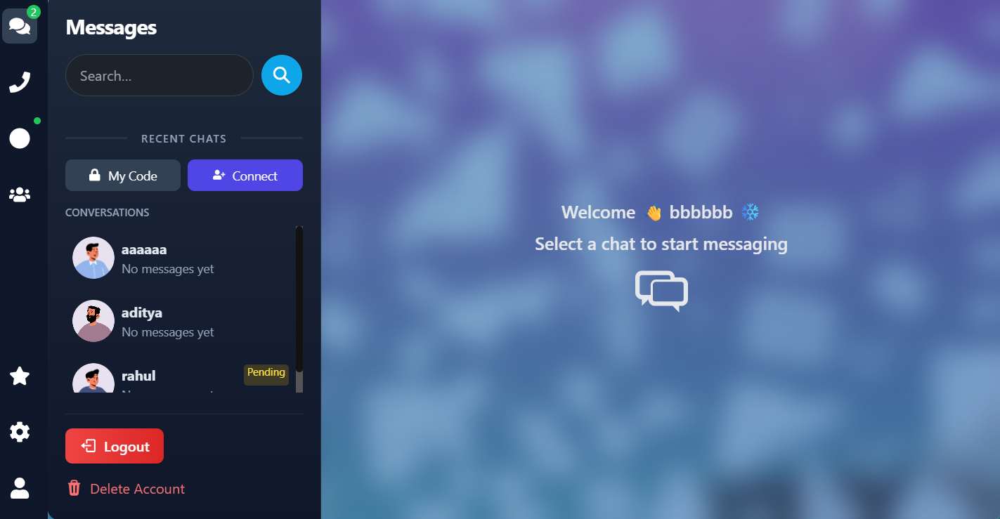
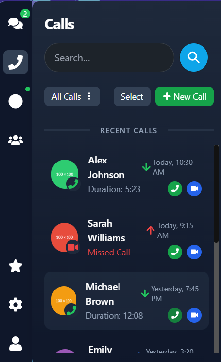
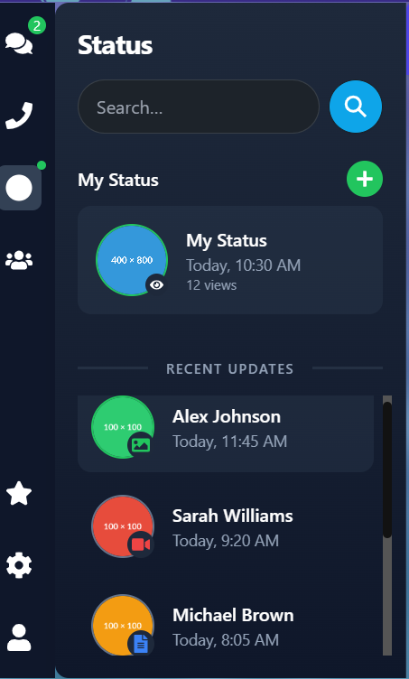

# 🚀 Modern Real-Time Chat Application



A modern, feature-rich chat application built with React, Socket.IO, and Node.js. Experience real-time messaging with a beautiful UI and advanced features.

<p align="center">
  
</p>

## ✨ Key Features

### 💬 Messaging
- Real-time message delivery with typing indicators
- Emoji support and file attachments
- Message status (sent, delivered, read)
- Message search and history
- Message reactions and replies

### 📞 Calls
- HD audio and video calls
- Screen sharing capabilities
- Call recording option
- Background blur in video calls
- Call history tracking

### 👥 Social Features
- User status updates (text, image, video)
- Story-like status feature
- Group conversations
- User presence indicators
- Contact management

### 🎨 User Experience
- Sleek dark mode interface
- Responsive design for all devices
- Custom animations and transitions
- Intuitive gesture controls
- Toast notifications

## 🖼️ Screenshots

<div align="center">
  
</div>

<div align="center">
  
</div>

## 🛠️ Tech Stack

<div align="center">
  
</div>

- **Frontend**: React 18, TailwindCSS, DaisyUI
- **Backend**: Node.js, Express
- **Database**: MongoDB with Mongoose
- **Real-time**: Socket.IO
- **State Management**: Zustand
- **Media**: WebRTC for calls
- **Authentication**: JWT, bcrypt

## 🚀 Quick Start

### Prerequisites

- Node.js 16+
- MongoDB
- Git

### Installation

1. Clone the repository
```bash
git clone https://github.com/yourusername/chat-application.git
cd chat-application
```

2. Install dependencies
```bash
# Backend dependencies
npm install

# Frontend dependencies
cd frontend
npm install
```

3. Environment Setup
```bash
# Root directory .env
MONGO_URI=your_mongodb_uri
JWT_SECRET=your_jwt_secret
PORT=5000

# Frontend .env
VITE_API_URL=http://localhost:5000
VITE_SOCKET_URL=http://localhost:5000
```

4. Start the application
```bash
# Start backend (from root directory)
npm run server

# Start frontend (from frontend directory)
npm run dev
```

## 📱 Mobile View

<div align="center">
  
</div>

## 🔐 Security Features

- End-to-end encryption for messages
- Secure file transfer
- JWT authentication
- Password hashing with bcrypt
- XSS protection
- Rate limiting

## 🎯 future changes

- [ ] Voice messages
- [ ] Message scheduling
- [ ] Multi-language support
- [ ] Push notifications
- [ ] File compression
- [ ] Message broadcasting

## 👥 Contributing

We welcome contributions! Please check our [Contributing Guidelines](CONTRIBUTING.md) for details.

## 📄 License

This project is licensed under the MIT License - see the [LICENSE](LICENSE) file for details.

## 💖 Support


<p align="center">
  Made with ❤️ by vaibhaw srivastav
</p>
